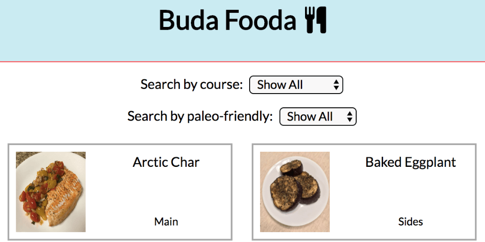

# Recipe App

<kbd></kbd>

I love to cook. A lot. And while I currently store all my recipes in Google Drive, they're pretty much all PDFs, so it can be a pain to read them on my phone. So this is basically a simple app to save all my favorite recipes that is responsive to any device and make it easier to read everything. And while yes, the name is absolutely horrid, at least it rhymes...

## Built With

- React
- React Router
- SCSS
- Webpack
- Babel

## Features

- Static front-end-only site with recipe information stored locally
- Responsive, mobile-first design
- Custom grid for recipe layout
- Recipe sorting by course

## Development

### Requirements

- Node.js 20.x
- npm
- This project includes a `.nvmrc` file. If you use `nvm`, run `nvm use` after entering the project directory to automatically select the correct Node.js version.

### Install Dependencies

```bash
npm install
```

### Start the Dev Server

```bash
npm start
```

### Create a Production Build

```bash
npm run build
```

## Live Site

[Link](https://buda-fooda.netlify.app/)
