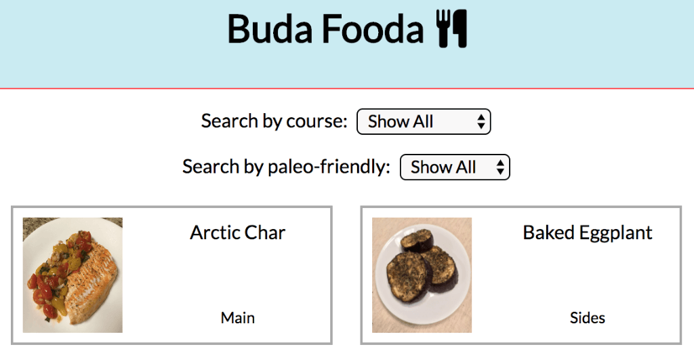

# Recipe App

<kbd></kbd>

I love to cook. A lot. Most of my recipes live in Google Drive as PDFs, but reading them on my phone isn't ideal. This app lets me keep my favorite recipes in a fast, mobile-friendly interface that's easy to browse while cooking. And yes, the name is terrible—but at least it rhymes.

## Built With

- React
- React Router
- SCSS
- Vite
- ESLint
- Prettier

## Features

- Static front-end-only site with recipe information stored locally
- Responsive, mobile-first design
- Custom grid for recipe layout
- Filter recipes by course

## Development

### Requirements

- Node.js 20.x
- pnpm
- This project includes a `.nvmrc` file. If you use `nvm`, run `nvm use` after entering the project directory to automatically select the correct Node.js version.

### Install Dependencies

```bash
pnpm install
```

### Start the Dev Server

```bash
pnpm dev
```

### Create a Production Build

```bash
pnpm build
```

### Linting

```bash
pnpm lint
pnpm lint:fix
```

### Format

```bash
pnpm format
pnpm format:check
```

### Check production build, linting, formatting

```bash
pnpm check
```

## Live Site

[Link](https://buda-fooda.netlify.app/)
